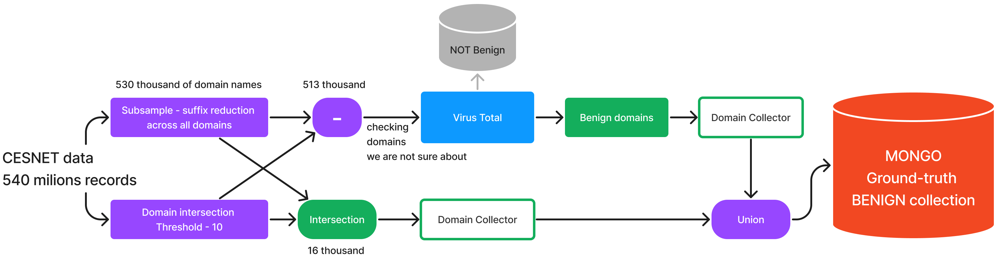
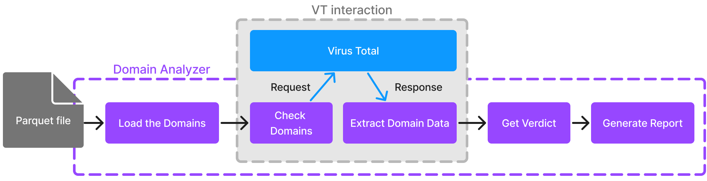
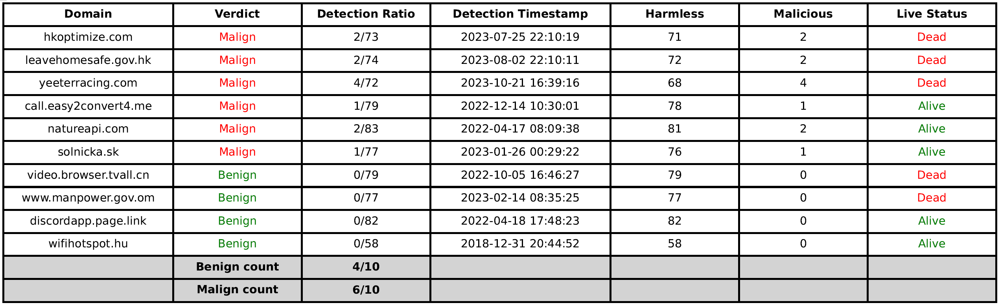

| Original Collection         | Ground Truth Collection | Falsely Labeled Domains (%) |
|-------------------------------|-------------------------|-----------------------------|
| Cesnet Intersect + Thresholding, Suffix Reduction (530k) *** | benign_2312 (462k)         | 12.83%                 |
| benign Cesnet Union 2307 (486.3k)                       | cesnet3_2311 (194.5k)       | 60.00%                      |
| malware_2310 (88.2k)                                    | malware_2311 (45.6k)       | 48.30%                      |
| misp_2310 (68.8k)                                       | misp_2311 (68.4k)          | 0.58%                       |


# 0) Own Benign Ground Truth Collection ***
This collection was creating by using different approaches and steps. The data was provided from CESNET, these are collected domain names across multiple months. Total amount of these domains names was over 500 milion. 

First step in reducing this amount was to use thresholding. This was done by using a threshold of 10. This means that a domain name had to be seen at least 10 times in order to be considered as important. This reduced the amount of domain names to 530k. At the same time I also reduced the amount of domain names by removing the suffixes that appeared a lot. Domains were grouped by their suffiexs, limited to 1000 same suffixes and then the rest was randomly removed. This reduced the amount of domain names to 486.3k.

Using this two approaches created set of domains (16k), the rest of domains from had to be inspected further using VT checker mentioned in the next section. At the end output of these two simulations was combined together to create a final set of benign domains (462k).



# 1) Domain Analyzer Script: An Overview

The `DomainAnalyzer` class is a sophisticated tool developed in Python, integrating various libraries for the analysis and reporting of domain names. This script is part of a broader research initiative aimed at enhancing the understanding and categorization of domain names with respect to cybersecurity threats.
The `DomainAnalyzer` class encapsulates functionalities for analyzing domain names by interfacing with the VirusTotal API. This class forms the core of a system designed to classify domain names into benign or malign categories based on various metrics provided by VirusTotal.



### Key Features and Functionalities

1. **API Integration and Configuration:**
   - Integrates with the VirusTotal API, a cornerstone for fetching domain-related data.
   - Implements a method `_load_api_key` to securely fetch the API key from environmental variables.
   - Establishes HTTP request headers through `_create_headers`, centralizing the API key and content type for subsequent requests.

    ```python
   def _load_api_key():
        load_dotenv()
        api_key = os.getenv('VT_API_KEY')
        if api_key is None:
            raise ValueError("API key is not set. Please set the VT_API_KEY environment variable.")
        return api_key

    def _create_headers(self):
        return {"x-apikey": self.api_key, "Accept": "application/json"}
    ```

2. **Domain Analysis Methods:**
   - The `check_domain` method conducts the primary API call to VirusTotal for a given domain, handling HTTP responses and errors.
   - Employs `_determine_verdict` to classify domains into 'Malign' or 'Benign' based on analysis statistics like the count of malicious and suspicious flags.
   - Includes a method `_is_domain_live` to ascertain the current operational status of a domain, augmenting the analysis with live/dead status.
    ```python
    def check_domain(self, domain: str) -> Optional[dict]:
        url = f"https://www.virustotal.com/api/v3/domains/{domain}"
        response = requests.get(url, headers=self.headers)
        if response.status_code == 200:
            return response.json()
        elif response.status_code == 429:
            print(f"Quota exceeded")
            return "Quota Exceeded"
        else:
            print(f"Error: Unable to fetch information for domain {domain}. {response.text}")
            return None

    def _determine_verdict(self, analysis_stats: dict) -> str:
        return "Malign" if analysis_stats.get('malicious', 0) > 0 or analysis_stats.get('suspicious', 0) > 1 else "Benign" 
            
    def _is_domain_live(self, domain: str) -> str:
        try:
            result = subprocess.run(['./livetest.sh', domain], capture_output=True, text=True)
            return "Alive" if result.stdout.strip() == '1' else "Dead"
        except Exception as e:
            print(f"Error: Unable to check if domain {domain} is live. {e}")
            return "Unknown"
    ```

3. **Data Extraction and Formatting:**
   - `extract_domain_data` method parses and extracts relevant data from the API response, including the domain's verdict, detection ratio, and last analysis timestamp.
   - A utility method `_format_timestamp` converts UNIX timestamps into human-readable date and time formats.
    ```python
        def extract_domain_data(self, domain: str, result: dict) -> Optional[Tuple]:
            try:
                attributes = result['data']['attributes']
                analysis_stats = attributes['last_analysis_stats']
                verdict = self._determine_verdict(analysis_stats)
                detection_ratio = f"{analysis_stats['malicious']}/{analysis_stats['malicious'] + analysis_stats['harmless']}"

                last_analysis_date = attributes.get('last_analysis_date', attributes.get('last_submission_date', 0))
                formatted_timestamp = self._format_timestamp(last_analysis_date) if last_analysis_date else 'N/A'

                domain_status = self._is_domain_live(domain)
                return (domain, verdict, detection_ratio, formatted_timestamp, analysis_stats.get('harmless', 0), analysis_stats.get('malicious', 0), analysis_stats.get('suspicious', 0), domain_status)
            except KeyError:
                print(f"Error: Could not extract analysis stats for domain {domain}")
                    return None
    ```

4. **Data Extraction and Analytical Processing:**
   - The script employs logic to classify domains as "Malign" or "Benign", based on their malicious and suspicious statistical data retrieved from VirusTotal.
   - Incorporates a shell script (`livetest.sh`) to determine the live status of each domain. This script utilizes a simple ping command to assess if a domain is operational ('Alive') or not ('Dead'), enhancing the depth of the analysis.

    ```sh
    ping -c 1 -W 1 $1 > /dev/null 2>&1 && echo 1 || echo 0
    ```

   - Methodically extracts and organizes a range of data points for each domain, including detection ratios, timestamps, and live status, forming the basis for comprehensive analysis.

5. **Data Management and Reporting:**
   - Methods `load_previous_data` and `save_data` facilitate the storage and retrieval of analyzed domain data, supporting CSV file formats.
   - The `save_checkpoint` function merges new analysis data with existing records, ensuring data integrity and continuity.
   - `generate_report` generates comprehensive PDF reports from the analyzed data, incorporating pagination and summary statistics.
   - This whole checkpoint funcionality was implemented due to VT API limitations. The academic API only allows 20000 requests per day, so the script has to be able to save the data and continue from where it left off.

6. **Batch Processing and Domain Selection:**
   - The method `process_selected_domains` orchestrates the overall process, handling domain batch processing based on predefined limits to comply with API call quotas.
   - Accommodates different input modes (e.g., 'txt', 'parquet') for domain name sources, enhancing the module's flexibility.
   - Implements progress tracking and quota management, ensuring efficient and responsible use of API resources.


7. **Report Generation**
   - The script efficiently calculates the count of benign and malign domains, integrating this summary into the DataFrame.
   - Utilizes Matplotlib to generate a visually engaging report, represented as a styled table. 

   


### Application in Cybersecurity Research

This script is an invaluable asset, that streamlines the process of analyzing large datasets of domain names, enabling a swift and accurate classification of these domains into benign or malign categories. 


# 2) Data Transformation and Transfer Script

Given the historical nature of the domain data, a I had to create a Python script to facilitate the transformation of old collected data into a new MongoDB collection. This script plays a crucial role in ensuring the data's relevance and usability in ongoing research.

### Script Functionality

- **MongoDB Connection Establishment**: The script starts by establishing a connection to a MongoDB instance using a specified URI.

- **Domain Data Reading**: It reads domain names from a file (`misp2311_finished_list.txt`). This finished list is a list of ground-truth domains that have been verified in the previous step.

- **Data Transfer Process**:
  - **Source and Destination Collections**: Identifies for one collection (old one, with collected data) as the source collection and the other one as the destination collection within the database `drdb`.
  - **Data Transfer Loop**:
    - Iterates over the list of domain names.
    - For each domain name, queries the source collection to retrieve associated records.
    - Inserts each found record into the destination collection.

### Implications for Research

 The script maintains data integrity during process of creating new colelctions.


